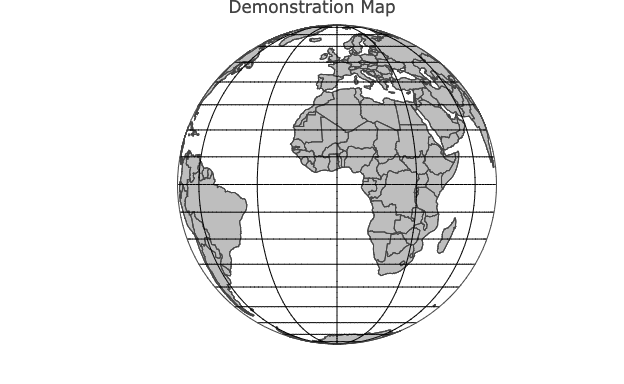
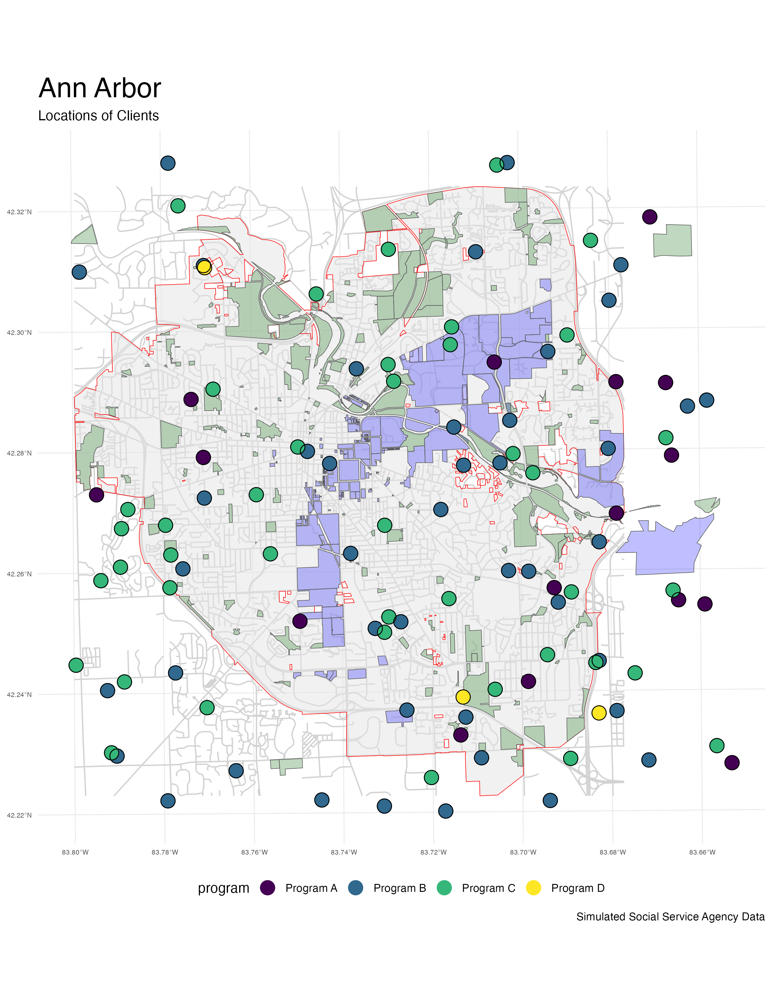
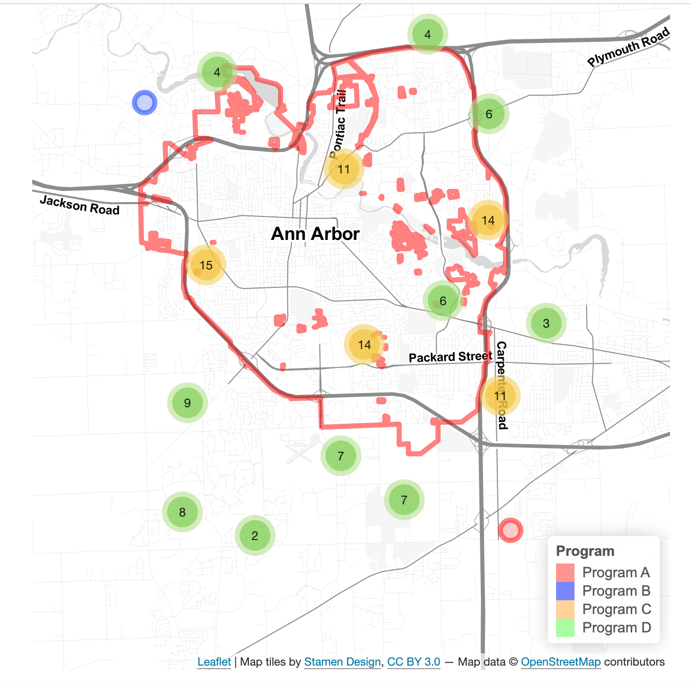

```{css, echo = FALSE}

h1.title {

  color: red;

}

```

```{r setup, include=FALSE}

knitr::opts_chunk$set(echo = FALSE)

```

```{r}

library(sf) # simple (spatial) features

library(leaflet) # beautiful maps

```

```{r}
#| label: fig-world
#| fig-cap: "Countries of the World"
#| fig-height: 3

global_data <- read_sf("../mapping/shapefiles/wrld_simpl/wrld_simpl.shp")

  leaflet() %>%
    setView(0, 0, zoom = 1.5) %>%
    addProviderTiles(providers$Esri.WorldImagery) %>%
    addPolygons(data = global_data, 
                fillOpacity = .0, 
                weight = 2,
                color = "#009edb", 
                label = global_data$NAME,
                highlightOptions = highlightOptions(color = "red", 
                                                    weight = 2,
                                                    bringToFront = TRUE)) 

```

# Geographical Concepts

```{r, eval = FALSE}
#| label: fig-globe
#| fig-cap: "Orthographic (Globe) Projection"
#| column: margin



```

* [latitude and longitude](./latitude-and-longitude/latitude-and-longitude.html)
* [map projections](./projections/projections.html)
* coordinate reference systems (CRS)
* symbology

# GIS Data

* shape files
    - joining external data to shapefiles
* text files w/ latitude and longitude
* addresses ([geocoding](./geocoding/geocoding-demo.html))
* base layers
* KML

# Libraries

```{r, eval=FALSE}
#| label: fig-ggplot
#| fig-cap: "ggplot Map of Simulated Clients"



```

```{r, eval=FALSE}
#| label: fig-leaflet
#| fig-cap: "Leaflet Map of Simulated Clients"



```

* `maps`
* [`ggplot`](./ggplot/ggplot-map-demo.html)  ([full size map](./ggplot/social-service-agency.pdf)) 
* `plotly`
* [`leaflet`](./leaflet/leaflet-map-demo.html) 
* `sf`
* `tidycensus`
* `mapboxapi`

# More Advanced Concepts

* [geocoding](./geocoding/geocoding-demo.html)
* geoprocessing
    + selection
    + spatial joins
    
# Other Software

* QGIS
* ArcGIS
* Tableau


